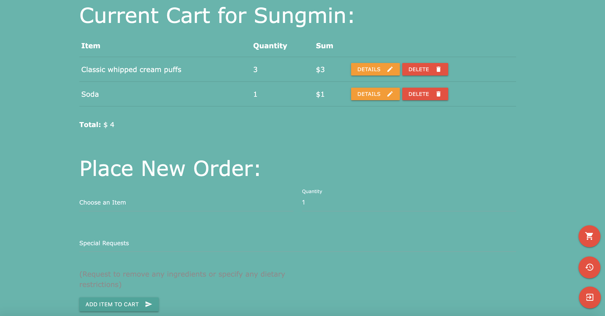

# Menu Organizer // Min Meals Ordering App
This is the Menu Organizer that I began building as a capstone project for the Web App Development course. Since then, I have expanded upon various functionalities to manage and allow users to place orders for my lunch business, Min Meals! Currently, students can log and order their desired menu item using this web app online via the heroku service: https://min-munches-lunch-order-app.herokuapp.com/. It is also now available with a secure connection on the custom domain: https://www.minmeals.com or minmeals.com (which is redirected to the previous link)!

Orders for Min Meals are taken weekly each week, unless otherwise announced. Please message me via my email or instagram (@minmunches_) for any questions regarding placing orders!

Built using the Materialize library and mysql2 DBMS, I can view, edit, and manage the menu, announcements, settings, users, history, and orders at once through this application. 

The web app is constantly being updated with new additions and changes based on feedback I am receiving from my peers and other users. 

Some snapshots of the web app are shown below.

**Lobby:**

**User Perspective:**

*Menu*

*Menu when the orders for a certain item are filled*

*Current cart and placing new orders*

*Order checkout page*

*Order history shown for each user*

**Admin Perspective:**

*The main welcome screen for admins*

 
*Making changes to the various settings for the app*

*Edit and create new items for the menu*

*Shows the list of all registered users*

*The order history for a particular user*

*The complete order history for all registered users*

